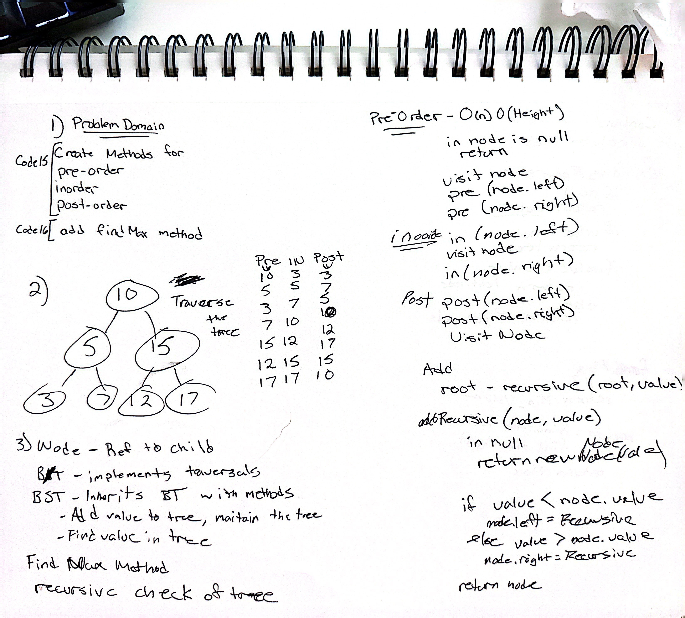
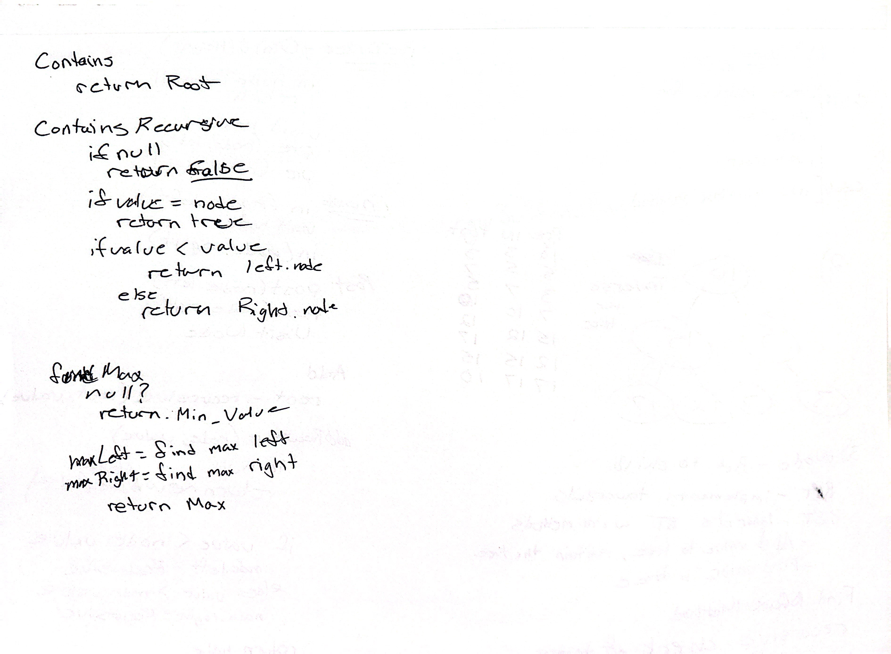
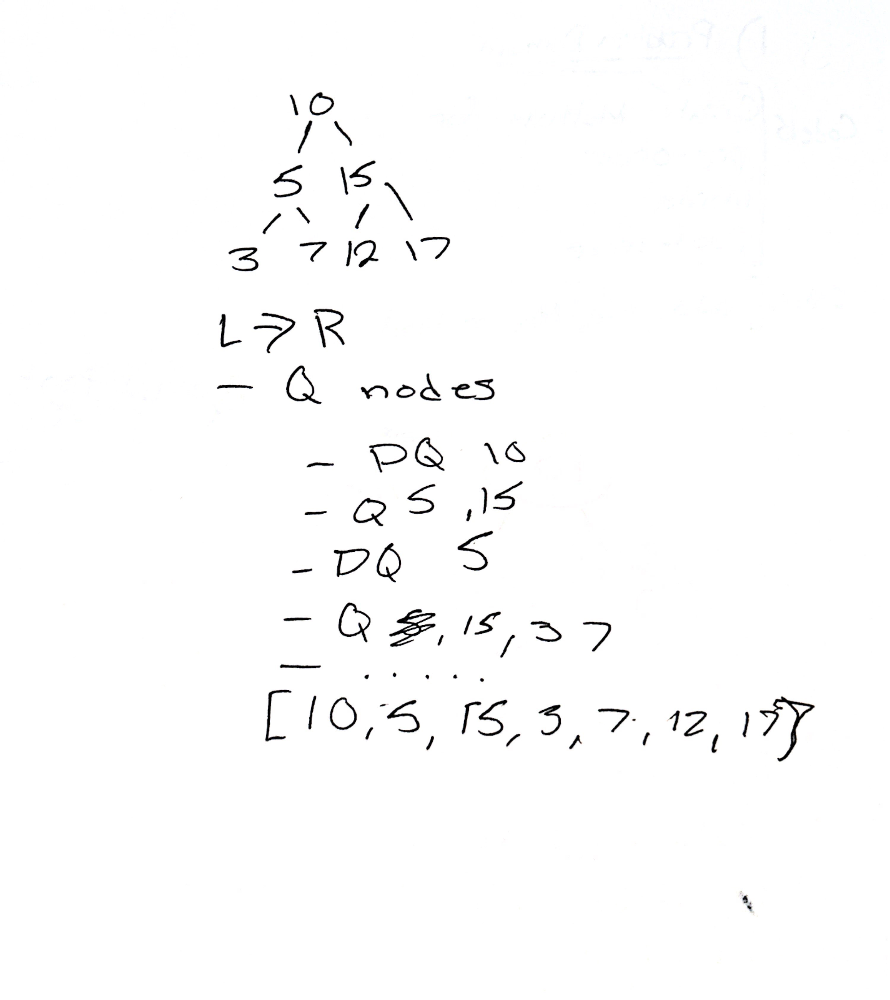

# Binary Trees and Binary Search Trees Implementation

The Binary Trees and Binary Search Trees Implementation is a Java program that demonstrates the usage and functionality of Binary Trees and Binary Search Trees. The application contains several classes, including `Node`, `BinaryTree`, `BinarySearchTree`, and `BreadthFirstTraversal`, which implement the respective data structures and their associated operations.

## Application Overview

The application consists of the following main components:

1. `Node` class: Represents a node object with value, left child, and right child properties for use in the Binary Trees and Binary Search Trees.
2. `BinaryTree` class: Implements a Binary Tree data structure with methods for depth-first traversals, including pre-order, in-order, and post-order traversals.
3. `BinarySearchTree` class: Implements a Binary Search Tree data structure, which is a subclass of the BinaryTree class, with additional methods for adding new nodes and checking if a value is present in the tree.
4. `BreadthFirstTraversal` class: Implements a breadth-first traversal for a Binary Tree, returning a list of all values in the tree in the order they were encountered.
5. `BinaryTreeTests` class: Contains JUnit Jupiter tests for validating the functionality of the BinaryTree, BinarySearchTree, and BreadthFirstTraversal classes.

## Getting Started

These instructions will help you get the project up and running on your local machine for development and testing purposes.

### Prerequisites

Make sure you have the following software installed:

- Java JDK 8 or later
- Gradle

### Installing

1. Clone the repository:

    ```
    git clone https://github.com/CodrCam/java-trees.git
    cd java-trees
    ```

2. Build the project:

   `$ gradle build`

## Running the Tests

To run the tests for the application, use the following command:

`$ gradle test`

The tests will validate the functionality of the BinaryTree, BinarySearchTree, and BreadthFirstTraversal classes, ensuring proper operation of depth-first traversal methods, breadth-first traversal, adding new nodes, and checking for the presence of a value in the tree.

## Whiteboard Images

### Binary Search Tree





This image demonstrates the structure of a sample Binary Search Tree with the following values: 10, 5, 15, 3, 7, 12, and 17.

### Depth-First Traversals and Breadth-First Traversal



This image visualizes the order of nodes visited during Pre-order, In-order, and Post-order depth-first traversals, as well as Breadth-first traversal for the sample Binary Search Tree.

## Time Spent on coding problem

- .1 hours on prep
- .7 hours on the build
- .8 hours total

## Built With

- [Java](https://www.oracle.com/java/) - The programming language used
- [Gradle](https://gradle.org/) - Build tool and dependency management
- [JUnit 5](https://junit.org/junit5/) - Testing framework for Java applications

## Authors

- Cameron Griffin - [CodrCam](https://github.com/CodrCam)

## License

This project is licensed under the MIT License - see the [LICENSE.md](LICENSE) file for details.
